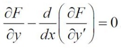
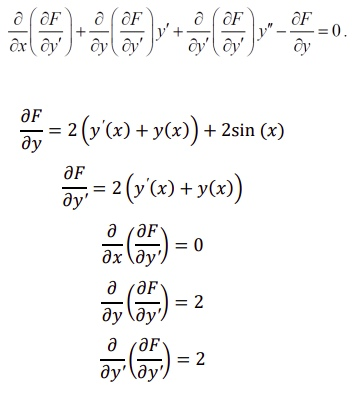
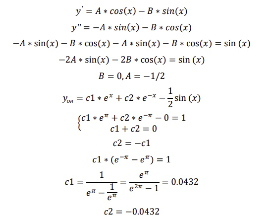

# Нелинейные задачи оптимизации
> Простейшая задача вариационного исчисления - задача с закрепленными
границами. Уравнение Эйлера.

## Уравнение по варианту
> .jpg)
`y(π)=1, y(0)=0`


### F (x, y, y') = (y'(x) + y(x))<sup>2</sup> + 2 * y(x) * sin(x)
Для того чтобы функционал `J (y)`, определенный на множестве
непрерывно дифференцируемых функций `D ={y(x)}`, удовлетворяющих
граничным условиям `y(x0)=y0, y(x1)=y1` достигал на функции `y(x)` экстремума,
необходимо, чтобы эта функция удовлетворяла уравнению Эйлера:
> 


Интегральные кривые дифференциального уравнения Эйлера
называются экстремалями. Уравнение Эйлера в развернутом виде после взятия
полной производной: 
> 


Сделаем замену аргументов для удобства расчета: `y(x)=y, y’0)=y’`
```
0 + 2y' + 2y'' - 2y' - 2y - 2 * sin(x) = 0
y'' - y - sin(x) = 0
k^2 * e^kx - e^kx = 0
k^2 - 1 = 0
k1 = 0
k2 = -1
y1 = e^x
y2 = e^-x
y00 = c1*e^x + c2*e^-x
```

Метод неопределенных коэффициентов, ищем частное решение:
> 


Полученное уравнение:
` y = 0.0432 * e^x - 0.0432 * e^-x - 1/2*sin(x)